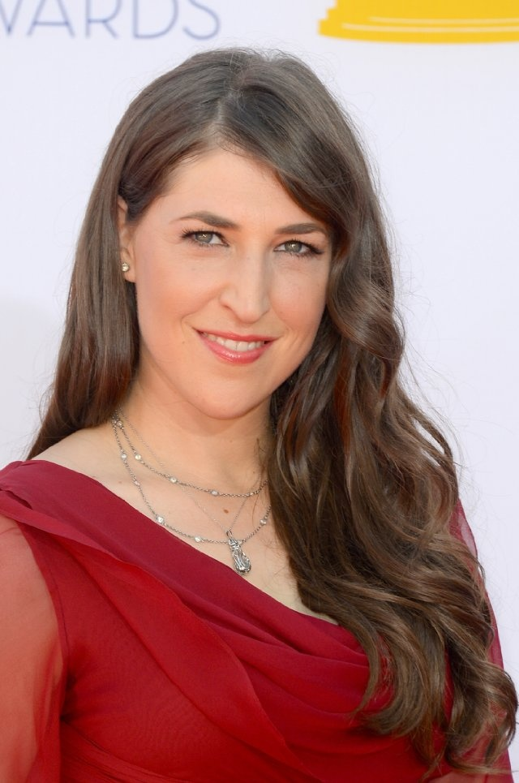
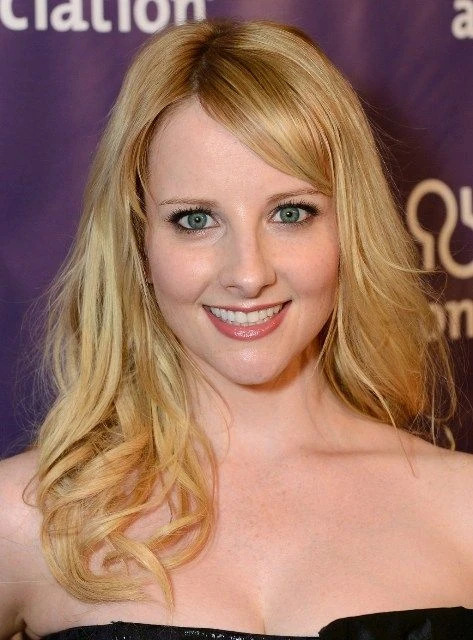
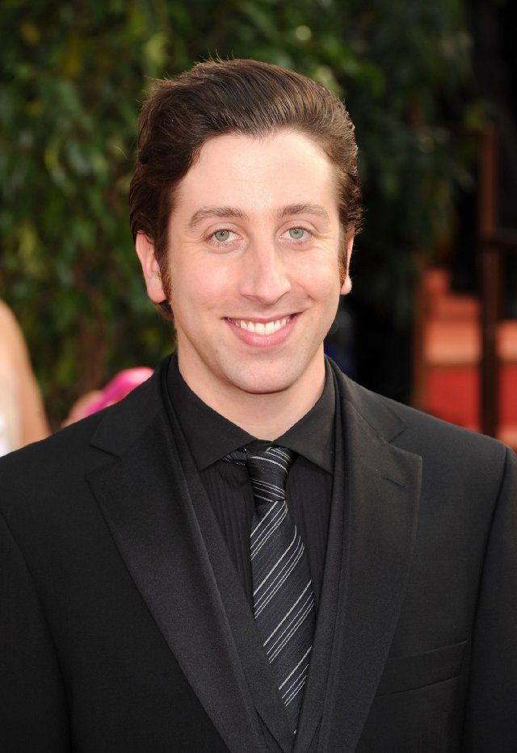
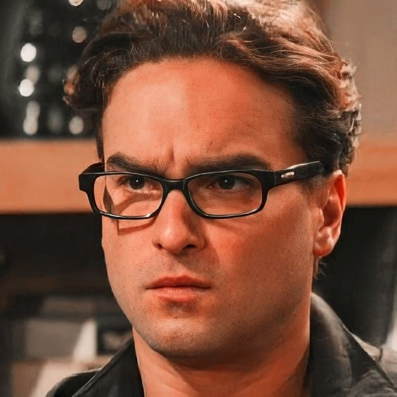
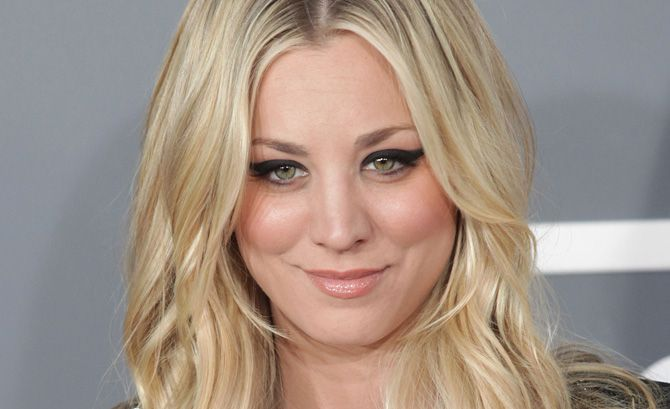
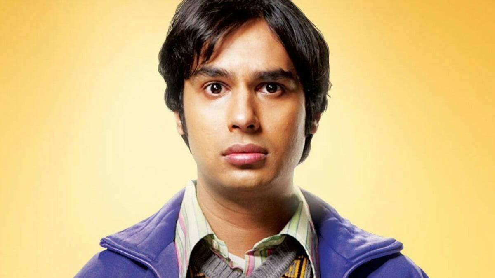
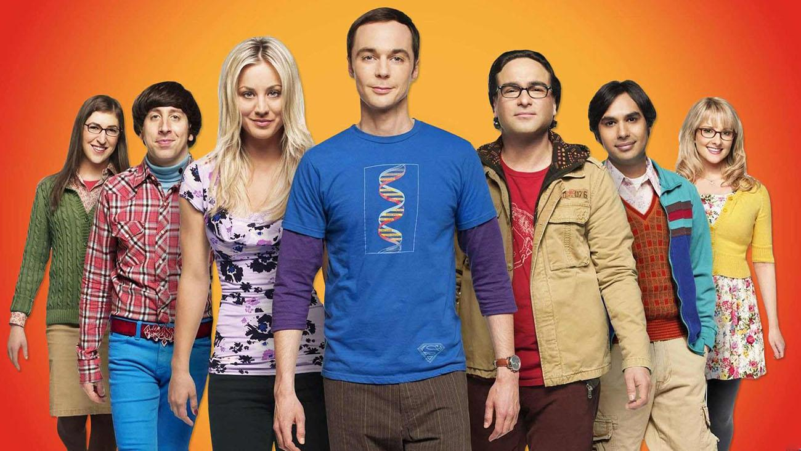
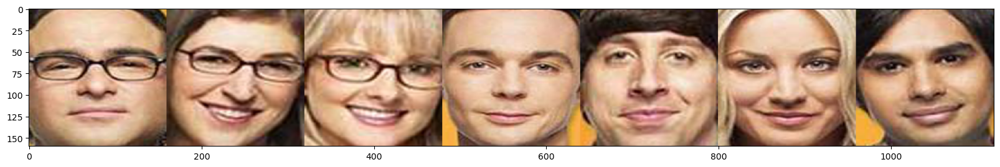
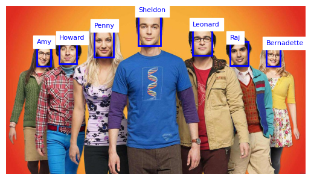

# Big Bang Theory Face Recognition

A facial recognition system that can detect and identify characters from the TV show The Big Bang Theory using deep learning techniques.

<p align="center">
  
  
  
  
  
  
  
</p>

> Images from the /face folder


## Project Overview

This project implements a facial recognition system capable of:
1. Detecting faces in images using MTCNN (Multi-task Cascaded Convolutional Networks)
2. Extracting facial embeddings using FaceNet via the DeepFace library
3. Comparing and matching faces against a pre-trained dataset of Big Bang Theory characters
4. Visualizing the recognition results with bounding boxes and character labels

## Technologies Used

- Python 3.x
- NumPy
- Matplotlib
- PIL (Python Imaging Library)
- MTCNN (Multi-task Cascaded Convolutional Networks)
- DeepFace
- SciPy

## How It Works

The system follows these steps to recognize characters:

0. **Dataset creation**: We need images from people we want to recognize for feature extraction.
1. **Face Detection**: The MTCNN model identifies and locates faces in the input image
2. **Feature Extraction**: Each detected face is processed to extract a 128-dimensional embedding vector using FaceNet
3. **Similarity Comparison**: The embeddings are compared against pre-computed embeddings of known characters
4. **Classification**: The system identifies the character based on the closest matching embedding using cosine similarity
5. **Visualization**: Results are displayed with bounding boxes and character names

## Results

The system successfully identifies the main characters from The Big Bang Theory including:

- Sheldon Cooper
- Leonard Hofstadter
- Penny
- Howard Wolowitz
- Raj Koothrappali
- Amy Farrah Fowler
- Bernadette Rostenkowski

### Original image
<p align="center">
  
</p>

### Detected faces
<p align="center">
  
</p>

### Classified faces
<p align="center">
  
</p>

## Project Structure
```bash
face-recognition-tbbt/
├── faces/             # Images of TBBT characters
├── test/              # Test images for recognition
│   └── bigbangtheory.jpg
├── /output-images      # Images output
├── face_recognizer.py # Main implementation
└── README.md          # This file
```

## Usage

1. Clone the repository

2. Prepare your dataset:
  - Place individual character face images in the `faces/` directory
  - Name each file with the character's name (e.g., `sheldon.jpg`, `leonard.jpg`)

3. Run the notebook
  - Install the dependencies on the first cell
  - Run the rest of the notebook 

## Run the recognition in another project:

1. Install project especific dependencies
  ```bash
  pip install mtcnn lz4 deepface tf-keras 
  ```

2. Use the FaceRecognizer class
  ```python
  # Import the FaceRecognizer class
  from face_recognizer import FaceRecognizer

  # Initialize the recognizer
  recognizer = FaceRecognizer()

  # Load the character dataset
  recognizer.extract_dataset_embeddings("./faces/")

  # Recognize and visualize faces in a test image
  recognizer.recognize_plot("./test/bigbangtheory.jpg")
  ```

## Acknowledgments

- The Big Bang Theory for the memorable characters
- The developers of MTCNN and DeepFace for their excellent tools
- The open-source community for making advanced facial recognition accessible
